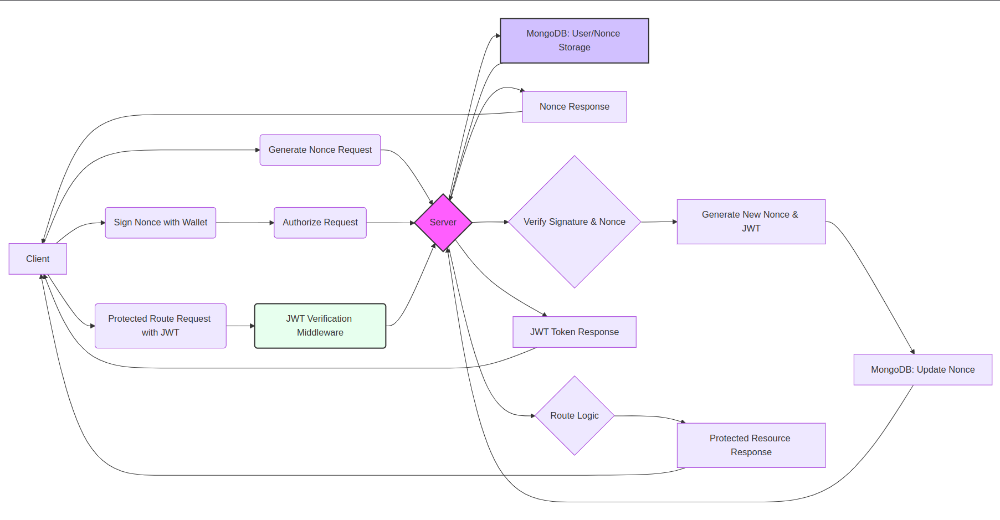

# Web3 Authentication System

This is a secure authentication system that leverages Ethereum wallet signatures for user authentication. It implements a nonce-based challenge-response authentication flow using Web3 technologies, ensuring secure and decentralized user verification.

## Table of Contents
- [Features](#features)
- [Installation Instructions](#installation-instructions)
- [Project Structure](#project-structure)
- [API Endpoints](#api-endpoints)
- [Authentication Flow](#authentication-flow)
- [Security Features](#security-features)
- [Dependencies](#dependencies)
- [Error Handling](#error-handling)
- [Conclusion](#conclusion)



## Features

- **Ethereum Wallet Authentication**: Secure authentication using cryptographic signatures
- **Nonce-based Challenge-Response**: Prevents replay attacks with unique nonce generation
- **JWT Token System**: Secure session management using JSON Web Tokens
- **MongoDB Integration**: Persistent storage for user data and nonces
- **Express.js REST API**: Clean and organized API architecture
- **Middleware Protection**: Route protection using JWT verification

## Installation Instructions

1. Clone the repository:
```bash
git clone <repository-url>
cd web3-authentication
```

2. Install dependencies:
```bash
npm install
```

3. Configure environment variables:
```env
PORT=5000
MONGO_URI=your_mongodb_connection_string
JWT_SECRET=your_jwt_secret_key
JWT_EXPIRY=24h
```

4. Start the server:
```bash
npm start
```

5. Launch the demo client:
```bash
cd mock-client
# On Linux/Mac
open index.html
# Or on Windows
start index.html
```

### Demo Requirements
- MetaMask browser extension installed and configured
- Modern web browser (Chrome, Firefox, or Edge recommended)
- Active internet connection for MetaMask and MongoDB connectivity

### Testing the Demo
1. Open the demo client in your browser
2. Click "Connect Wallet" to connect your MetaMask
3. Approve the MetaMask connection when prompted
4. Click "Authenticate" to start the authentication process
5. Sign the message in MetaMask when requested
6. You'll see the authentication token displayed upon success

### Demo Features
- Wallet connection status display
- Real-time authentication feedback
- JWT token display
- Automatic session management
- Clean, responsive interface

## Project Structure
```
├── src/
│   ├── config/
│   │   └── db.js            # Database configuration
│   ├── controllers/
│   │   └── authController.js # Authentication logic
│   ├── middleware/
│   │   └── auth.js          # JWT verification middleware
│   ├── models/
│   │   └── User.js          # User model schema
│   ├── routes/
│   │   └── authRoutes.js    # Authentication routes
│   └── services/
│       └── authService.js    # Authentication services
├── routes.js                 # Route aggregator
├── server.js                 # Application entry point
└── package.json             # Project dependencies
```

## API Endpoints

### Authentication Routes
All routes are prefixed with `/api/auth`

1. **Generate Nonce**
   - **Endpoint**: POST `/nonce`
   - **Body**: 
     ```json
     {
       "walletAddress": "0x..."
     }
     ```
   - **Response**:
     ```json
     {
       "message": "Successful",
       "nonce": 123456
     }
     ```

2. **Authorize User**
   - **Endpoint**: POST `/authorize`
   - **Body**:
     ```json
     {
       "walletAddress": "0x...",
       "signature": "0x..."
     }
     ```
   - **Response**:
     ```json
     {
       "message": "Authentication Successful",
       "token": "jwt_token_here"
     }
     ```

## Authentication Flow

1. **Nonce Generation**
   - Client sends wallet address to server
   - Server generates/retrieves nonce for the address
   - Nonce is stored in database with user record

2. **Signature Creation**
   - Client signs nonce with Ethereum wallet
   - Signature and wallet address sent to server

3. **Verification & Token Generation**
   - Server verifies signature against stored nonce
   - New nonce generated for next authentication
   - JWT token issued upon successful verification

4. **Protected Route Access**
   - Client includes JWT in Authorization header
   - Server validates token for protected routes

## Security Features

- **Nonce-based Authentication**: Prevents replay attacks
- **JWT Token System**: Secure session management
- **Signature Verification**: Cryptographic proof of wallet ownership
- **MongoDB User Storage**: Secure user data persistence
- **CORS Protection**: Configured cross-origin resource sharing
- **Environment Variables**: Secure configuration management

## Dependencies

- **express**: ^4.21.2 - Web framework
- **mongoose**: ^8.10.1 - MongoDB ODM
- **ethers**: ^6.13.5 - Ethereum wallet utilities
- **jsonwebtoken**: ^9.0.2 - JWT implementation
- **bcryptjs**: ^3.0.2 - Password hashing
- **cors**: ^2.8.5 - Cross-origin resource sharing
- **dotenv**: ^16.4.7 - Environment configuration

## Error Handling

The system implements comprehensive error handling for:

1. **Authentication Errors**
   - Invalid signatures
   - Expired tokens
   - Missing authentication

2. **Database Errors**
   - Connection failures
   - Query errors
   - Validation errors

3. **Request Validation**
   - Missing parameters
   - Invalid wallet addresses
   - Malformed requests

4. **Server Errors**
   - Internal server errors
   - Service unavailability
   - Timeout handling

## Conclusion

The Web3 Authentication System provides a robust and secure solution for implementing blockchain-based authentication in modern web applications. By leveraging Ethereum's cryptographic capabilities and combining them with traditional web security practices, this system offers:

- **Enhanced Security**: Through the combination of wallet signatures and nonce-based authentication
- **Decentralized Identity**: Allowing users to authenticate using their blockchain wallets
- **Scalable Architecture**: Built on proven technologies like Express.js and MongoDB
- **Developer-Friendly**: Well-structured codebase with clear separation of concerns
- **Production-Ready**: Comprehensive error handling and security measures

This system serves as a foundation for building decentralized applications (dApps) that require secure user authentication while maintaining the principles of Web3 technology. Whether you're building a DeFi platform, NFT marketplace, or any blockchain-based application, this authentication system provides the necessary infrastructure to handle user authentication securely and efficiently.
